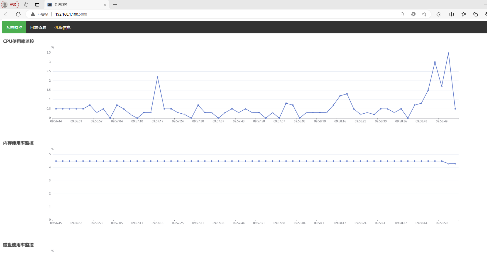
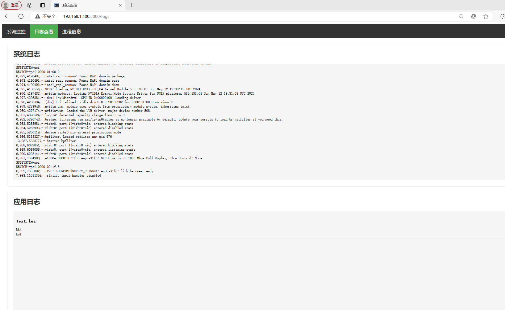
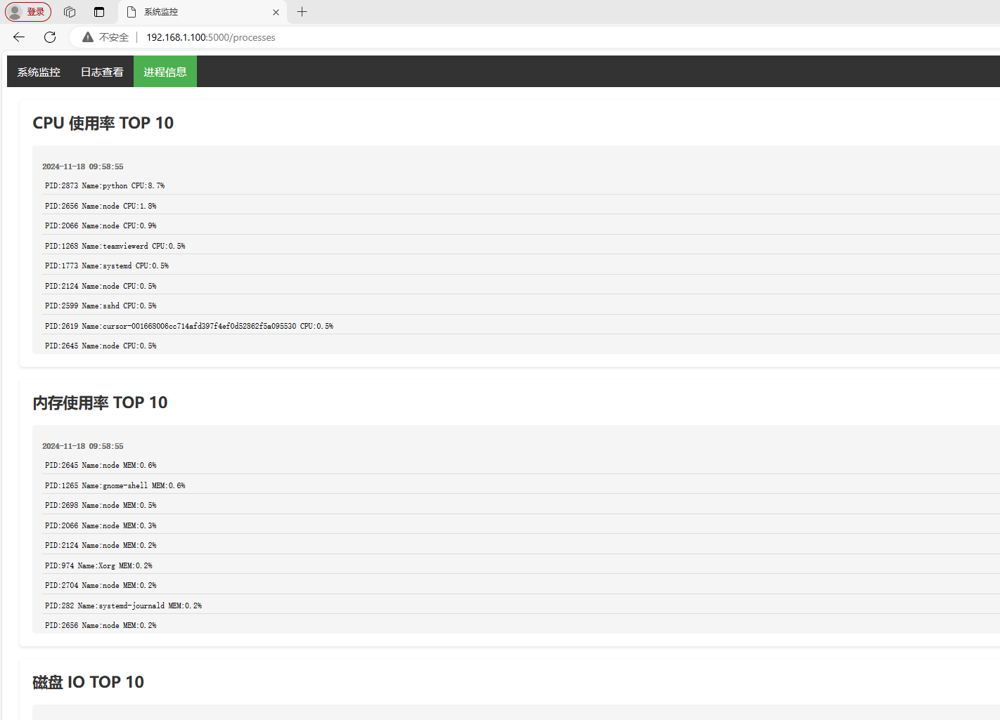
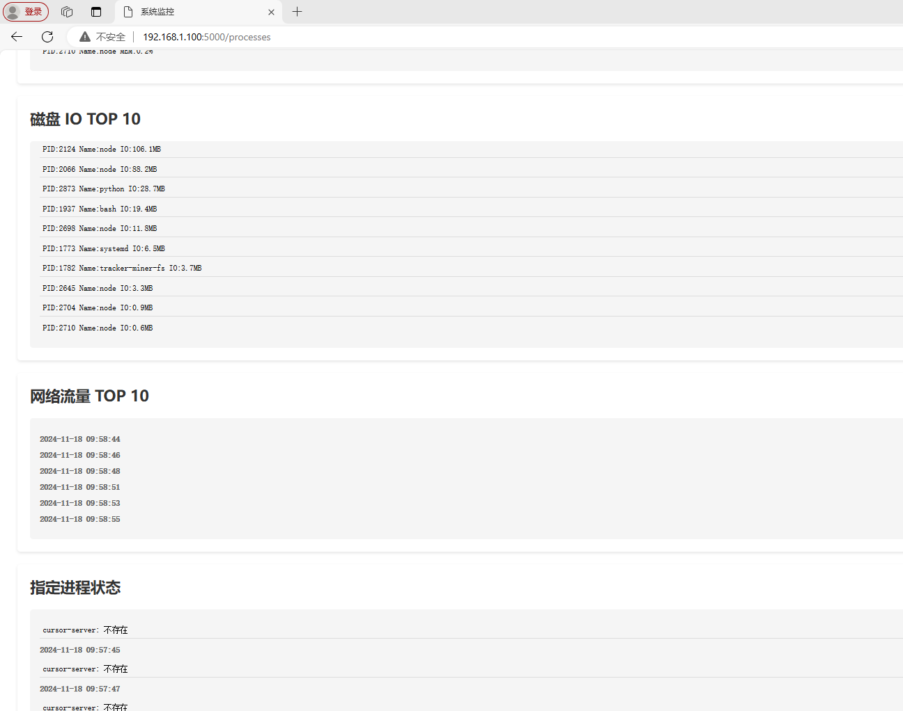

# Linux System Runtime Parameter Collection Tool

A monitoring tool for collecting and displaying Linux system runtime parameters, designed for AI-assisted operations and maintenance systems.

## Features

- Real-time system parameter collection
- Web interface for data visualization
- Multiple system metrics monitoring
- Configurable process monitoring
- Log file tracking

## Function Description

### System Monitoring
- CPU usage
- Memory usage
- Disk capacity
- Disk I/O
- Network traffic

### Log Monitoring
- Kernel logs
- Custom log files (configurable)

### Process Monitoring
- Top 10 CPU-consuming processes
- Top 10 memory-consuming processes
- Top 10 disk I/O processes
- Top 10 network traffic processes
- Specified process status monitoring

## Interface Preview

### System Monitoring Page

### Log Viewing Page

### Process Information Page

## Configuration Files

### File Collection Configuration
Location: `./config/collect_files.conf`

## Data Storage

All monitoring data is stored in the `./result/` directory:
- CPU data: `cpu.txt`
- Memory data: `memory.txt`
- Disk data: `disk.txt`
- Disk I/O data: `disk_io.txt`
- Network data: `network.txt`
- Kernel logs: `kernel.txt`
- Process monitoring data:
  - `cpu_top10.pids`
  - `memory_top10.pids`
  - `disk_top10.pids`
  - `network_top10.pids`
  - `process_exist.txt`

## Technology Stack

- Backend: Python
- Frontend: HTML, CSS, JavaScript
- Chart Library: ECharts
- System Tools: psutil

## Update Frequency

- System data: Every 1 second
- Web page data: Every 5 seconds
