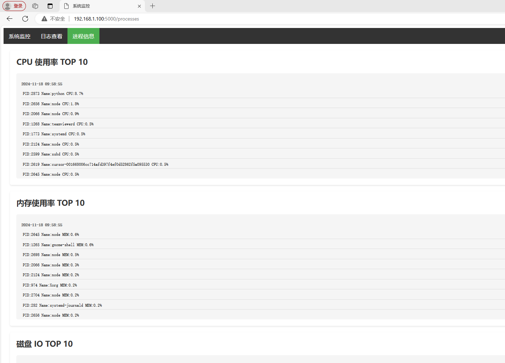
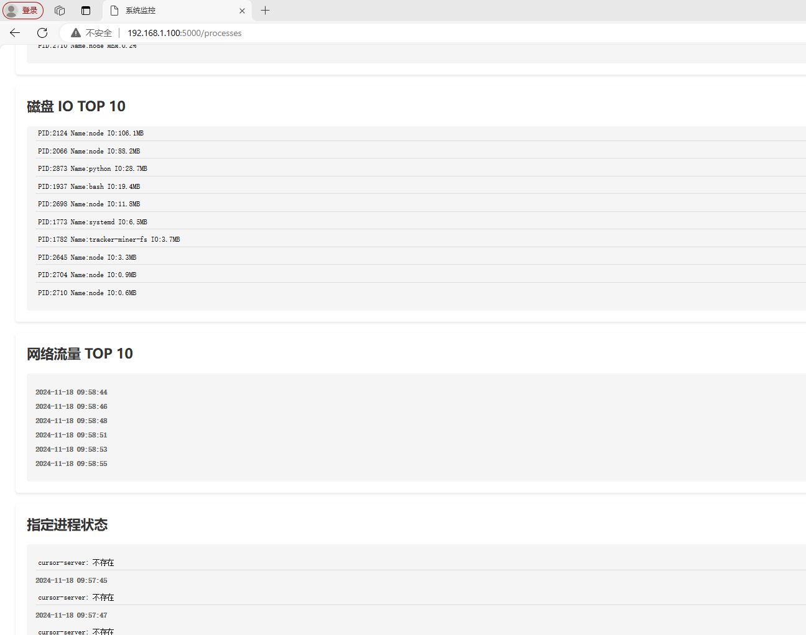

# Linux系统运行时参数收集程序

一个用于收集和展示Linux系统运行时参数的监控工具，用于AI辅助运维系统。

## 功能特点

- 实时收集系统运行参数
- Web界面展示监控数据
- 支持多种系统指标监控
- 可配置的进程监控
- 日志文件追踪

## 功能说明

### 系统监控
- CPU使用率
- 内存使用情况
- 磁盘容量
- 磁盘IO
- 网络流量

### 日志监控
- 内核日志
- 自定义日志文件（可配置）

### 进程监控
- CPU占用TOP10进程
- 内存占用TOP10进程
- 磁盘IO TOP10进程
- 网络流量TOP10进程
- 指定进程状态监控

## 界面预览

### 系统监控页面

### 日志查看页面

### 进程信息页面

## 配置文件

### 收集文件配置
位置：`./config/collect_files.conf`

## 数据存储

所有监控数据存储在 `./result/` 目录下：
- CPU数据：`cpu.txt`
- 内存数据：`memory.txt`
- 磁盘数据：`disk.txt`
- 磁盘IO数据：`disk_io.txt`
- 网络数据：`network.txt`
- 内核日志：`kernel.txt`
- 进程监控数据：
  - `cpu_top10.pids`
  - `memory_top10.pids`
  - `disk_top10.pids`
  - `network_top10.pids`
  - `process_exist.txt`

## 技术栈

- 后端：Python
- 前端：HTML, CSS, JavaScript
- 图表库：ECharts
- 系统工具：psutil

## 更新频率

- 系统数据：每1秒更新一次
- 网页数据：每5秒刷新一次
